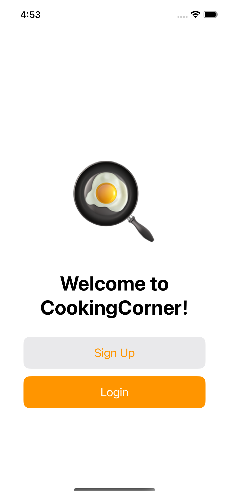

# CookingCorner

## Overview

CookingCorner is an iOS app built using Swift and SwiftUI. It serves as a platform for users to create, edit, and view recipes. The app uses Firebase for user authentication and Firestore to fetch and create data.

## Features

### General

- **Persistent Login**: Users remain logged in even after the app is terminated.
- **Dark Mode Support**: The app supports dark mode for better usability.

### Start Page

- Initial page with options to login or sign up.

<figure>
  
  <figcaption>Start Page</figcaption>
</figure>

### Login Page

- User authentication using Firebase.
- Alerts to show if there is an error encountered during login.

<figure>
  
  <figcaption>Alert Messages</figcaption>
</figure>

### Signup Page

- New user registration.
- Alerts to show if there is an error encountered during signup.
  
<figure>
  
  <figcaption>Sign Up Flow</figcaption>
</figure>

### Content View

- Displays a list of recipes.
- Recipes are sorted by time last modified, with the most recent at the top.
- Recipes created by the current user are highlighted.
- Logout functionality using Firebase.

  <figure>
    
  </figure>
  <figure>
    
  </figure>

### Add Recipe View

- Users can create their own recipes.
- Users can only modify their own recipes.
- Delete individual ingredients and instructions by swiping them from right to left.
- Rearrange the order of ingredients and instructions by holding and moving the row to the desired location.

  <figure>
    
  </figure>
  <figure>
    
  </figure>
  <figure>
    
  </figure>
  <figure>
    
  </figure>

### Dark Mode
- The app supports dark mode for better usability.

<figure>
  
  <figcaption>Dark Mode</figcaption>
</figure>

## Requirements

- iOS 14.0+
- Xcode 12.0+

## Installation

1. Clone the repository.

`git clone https://github.com/teslakoile/recipe-blog-trial-project`

2. Open the project in Xcode.
3. Run the app in the simulator or on a device.

## Firebase Setup

To replicate this project, you'll need to set up your own Firebase project. Follow these steps:

1. **Create a Firebase Project**: Go to the [Firebase Console](https://console.firebase.google.com/) and create a new project if you haven't already.

2. **Add Your App to the Project**: Once the project is created, add an iOS app to it. You'll be provided with a `GoogleService-Info.plist` file.

3. **Download Config File**: Download the `GoogleService-Info.plist` file and add it to your Xcode project.

4. **Run Your App**: Build and run your app. You should now be connected to your own Firebase project.

## Usage

1. Log in or sign up from the Start Page.
2. Navigate to the Content View to see a list of recipes.
3. Add a new recipe by clicking the "Add" button.
4. Edit or delete recipes by clicking on them.
